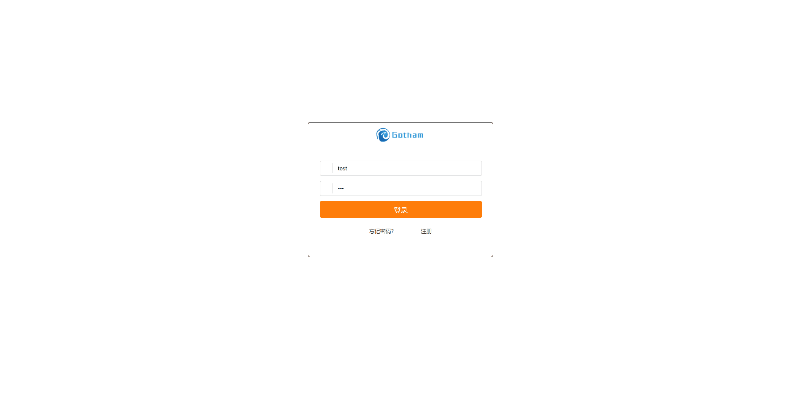
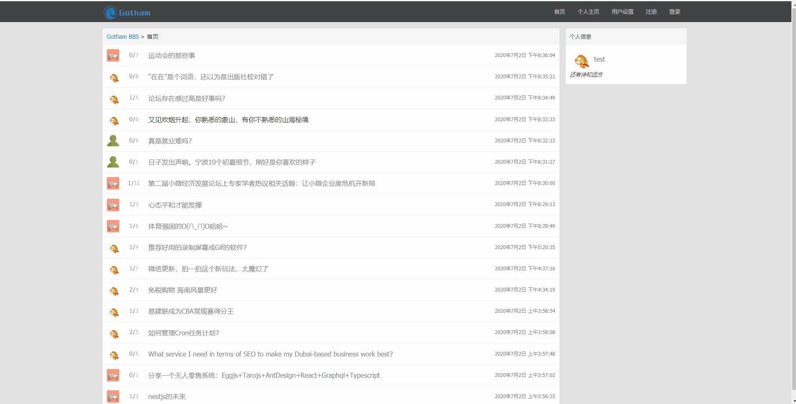
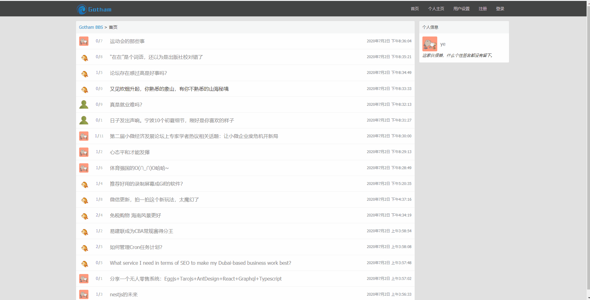

已上线 http://106.54.164.16/ 欢迎访问。

示例动图加载较慢，请耐心等待。

## 基于Java SSM(Spring+SpringMVC+MyBatis)的个人论坛
数据存储使用MySQL，使用MyBatis读取数据，模板引擎使用freemarker，使用Redis进行缓存优化。

### 主要功能
用户登陆、个人主页、信息管理功能；
话题的编辑、发布、删除、评论；
使用邮箱注册，使用注册邮箱找回密码。

### 安全与优化
实现对CSRF、XSS、SQL注入攻击的防御；
使用服务器端Session实现用户登录、登出；Session和页面Token使用redis进行存储；
变动频率较低的数据实现基于 Redis 的缓存优化，后续请求命中缓存时不需进行数据库操作，实现性能优化，减轻数据库访问压力。

### 项目部署
使用nginx进行反向代理，过滤静态资源请求；
利用Tomcat作为servlet容器，并且能自动部署项目

## 详细
### 登录与话题操作

### 个人主页与设置

### 找回密码示例

